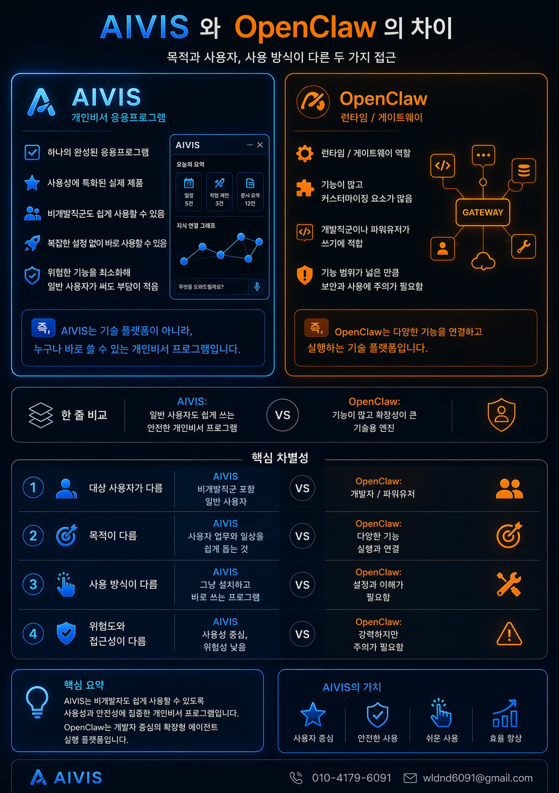

# 경쟁사 분석

## AIVIS vs OpenClaw

### 핵심 차별점

| 구분 | AIVIS | OpenClaw |
|------|-------|----------|
| 대상 사용자 | 비개발자 포함 일반 사용자 | 개발자/파워유저 중심 |
| 기억 방식 | 로컬 MD 파일로 가시화 | 서비스 내부 저장 |
| 데이터 소유 | 사용자 완전 소유 | 플랫폼 종속 가능성 |
| 사용 난이도 | 프롬프트 없이도 사용 가능 | 숙련도 필요 |
| 확장성 | 다른 AI와 협력 구조 | 독립 게이트웨이 방식 |

### AIVIS의 포지셔닝
> "AIVIS는 누구나 쉽게 쓸 수 있는, 개인 운영체계가 되는 AI 비서"
> "OpenClaw는 기능적으로 연결하는 AI 게이트웨이"

두 서비스는 경쟁보다 협력 관계 — AIVIS가 사용자 레이어, OpenClaw가 기능 레이어 담당 가능.

---

## 주요 경쟁 서비스 비교

| 서비스 | 카테고리 | AIVIS와의 차이 |
|--------|----------|---------------|
| ChatGPT | 범용 AI 챗 | 기억 없음, 로컬 저장 없음 |
| Claude | 범용 AI 챗 | 기억 없음, 로컬 저장 없음 |
| Notion AI | 문서 AI | 특정 플랫폼 종속 |
| Obsidian + 플러그인 | 지식 관리 | AI 대화 기능 약함 |
| Mem.ai | AI 메모 | 클라우드 종속, 음성 약함 |

---

## 핵심 진입 전략
- 기존 Obsidian 사용자 → 즉시 연동 가능한 강력한 차별점
- 비개발자 지식노동자 → 프롬프트 없이 쓸 수 있는 진입 장벽 낮춤
- 개인정보 민감 사용자 → 로컬 우선 저장으로 신뢰 확보
