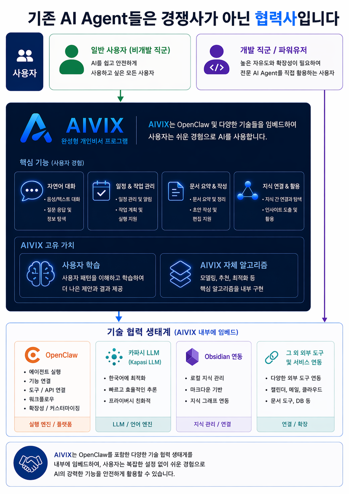

# AIVIS — 서비스 개요

## 한 줄 정의
음성/텍스트 기반으로 사용자와 소통하고, 사용자의 기억·문서·지식을 로컬 저장소와 Second Brain에 축적·관리하는 개인 AI 비서 앱

## 핵심 포지셔닝
**"말하면 정리되고, 기억되며, 내 파일 구조에 남는 개인 AI 비서"**

ChatGPT처럼 답만 하는 AI가 아니라, 내 기억과 지식을 내 폴더에 축적하는 AI.

---

## 서비스 방향성

### 핵심 원칙
- 비개발자도 쉽게 사용 가능
- 단순 채팅형 AI가 아닌 **개인 운영체계**
- 사용자 데이터는 **로컬 우선** 저장
- AI의 기억과 저장 구조가 **사용자에게 투명하게** 보임
- 초기엔 비전 기능 없이도 강한 가치 제공
- 비전 기능은 Phase 3에서 점진 도입

### 핵심 차별화
| 항목 | AIVIS | 기존 AI (ChatGPT 등) |
|------|-------|---------------------|
| 프롬프트 | 몰라도 사용 가능 | 잘 알아야 효과적 |
| 저장 방식 | 로컬 MD 파일 구조 | 서비스 내부 종속 |
| 기억 가시화 | md/폴더로 직접 확인 | 블랙박스 |
| Obsidian 연동 | 지원 | 없음 |
| 데이터 소유 | 사용자 소유 | 서비스 소유 |

---

## 주요 화면 구성

### 메인 대시보드
- 오늘 일정, 시간 분석, AI Agent 목록 표시
- push-to-talk 버튼으로 즉시 음성 입력
- 현재 진행 중인 프로젝트/태스크 현황

### Second Brain
- 사용자의 지식/기억을 Mind Map 형태로 시각화
- 노드 간 연결 구조로 지식 그래프 형성
- Obsidian vault와 동기화

### 사용자 학습 리포트
- AIVIS가 학습한 사용자 정보 현황
- 사용 패턴 분석 및 학습 현황 점수
- 주요 관심사, 자주 쓰는 기능 Top 10

---

## 핵심 기능 (MVP)

### 포함
- 텍스트/음성 대화 (push-to-talk)
- 대화 로그 저장
- Markdown 메모 저장
- 사용자 기억 반영
- 개인 폴더 구조 생성
- Obsidian vault 연동

### 제외 (초기)
- 상시 녹음 / 상시 카메라
- 얼굴 학습 / 감정·표정 추론
- 자동 메일 발송 / 자동 일정 등록
- 위험한 파일 자동 삭제/수정

---

## 기술 생태계

AIVIS는 기존 AI Agent들과 경쟁하지 않고 협력하는 구조로 설계.
OpenClaw 등 기존 에이전트와 연동하여 사용자 경험을 확장.

