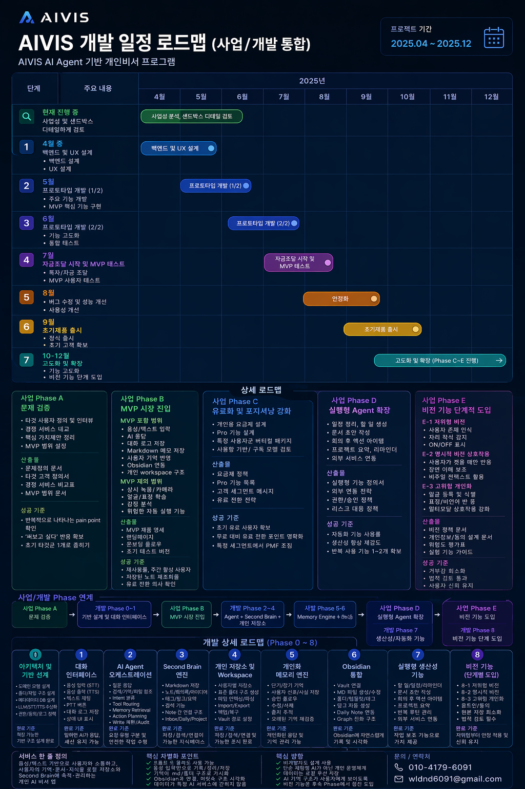

# AIVIS 개발 로드맵 개요

## Phase 구조

| Phase | 목표 | 기간 | 상태 |
|-------|------|------|------|
| [Phase 1](phase-1.md) | 대화 + 홈 대시보드 기본 루프 | 2~3개월 | 🟡 진행 중 (80%) |
| [Phase 2](phase-2.md) | 외부 연동 + 기억 + Second Brain | 3~4개월 | ⬜ 예정 |
| [Phase 3](phase-3.md) | 실행형 기능 + 유료화 | 2~3개월 | ⬜ 예정 |
| [Phase 4](phase-4.md) | 설치 매니저 + 배포 패키지 | 1~2개월 | ⬜ 예정 |

**총 기간:** 약 8~12개월

---

## 현재 구현 완료 기능 (2026-05-12)

- ✅ 텍스트 채팅 + SSE 스트리밍 (Ollama llama3.2)
- ✅ 대화 세션 관리 (생성/조회/삭제)
- ✅ 사용자 DB (최지웅 / local)
- ✅ ConversationQuality — 한국어 강제, 사용자별 시스템 프롬프트
- ✅ 홈 대시보드 UI — 4컬럼 리사이즈 레이아웃
- ✅ 뉴스 탭 UI (목업), 일정 타임라인 UI (목업)
- ✅ 시간 분석 도넛 차트 (목업)
- ✅ AI 작업 제안 카드 UI (목업)
- ✅ Docker Compose 전체 스택 (postgres + backend + frontend)

---

## Phase 2 주요 목표 (다음 단계)

| 기능 | 분류 | 우선순위 |
|------|------|----------|
| 날씨 API 연동 (OpenWeatherMap) | 외부 연동 | 높음 |
| 뉴스 RSS 수집 Background Service | 외부 연동 | 높음 |
| AI 작업제안 실제 생성 + 로컬 캐시 | AI 기능 | 높음 |
| WorkspaceManager (~/AIVIS/ 폴더) | 인프라 | 높음 |
| 일정 데이터 로컬 저장/로드 | 코어 | 높음 |
| 시간 분석 실제 계산 (일/주/월) | 분석 | 보통 |
| Google Calendar 연동 | 외부 연동 | 보통 |
| 음성 입력/출력 (STT/TTS) | 음성 | 보통 |
| 메모리 엔진 (장기 기억) | AI 기능 | 보통 |
| 설정 화면 UI | UI | 낮음 |

---

## 로컬 파일 저장 구조

→ [local-workspace.md](../03_architecture/local-workspace.md) 참고

```
~/AIVIS/
├── users/local/          ← 선호도, 작업제안 캐시
├── conversations/        ← 대화 로그 MD
├── schedule/             ← 일정 + 시간 분석
├── news/cache/           ← 뉴스 캐시 (TTL 6h)
├── weather/cache/        ← 날씨 캐시 (TTL 1h)
└── workspace/            ← Second Brain (Phase 2)
```

---

## 비용 원칙

초기엔 **전부 무료 스택**으로 구축. 모든 외부 서비스는 교체 가능한 어댑터 구조로 설계.


