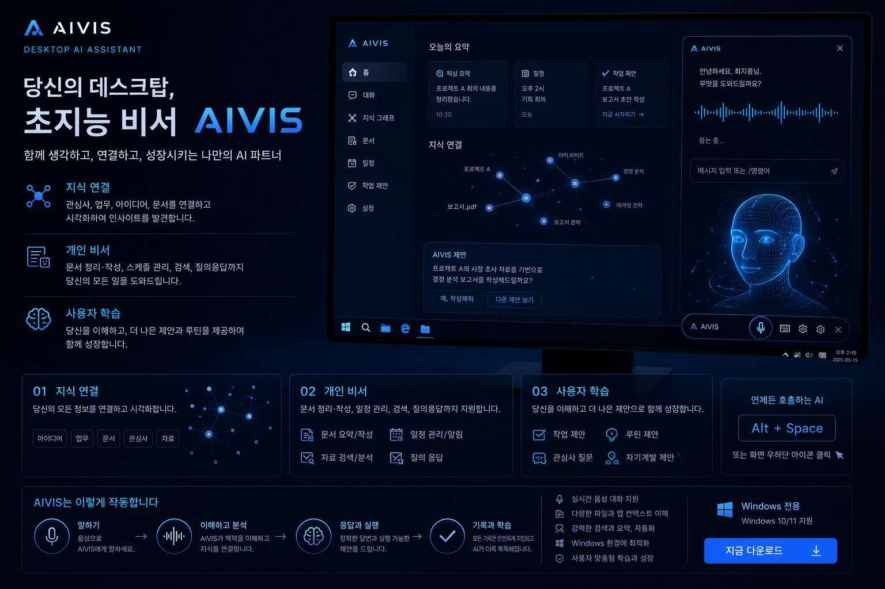
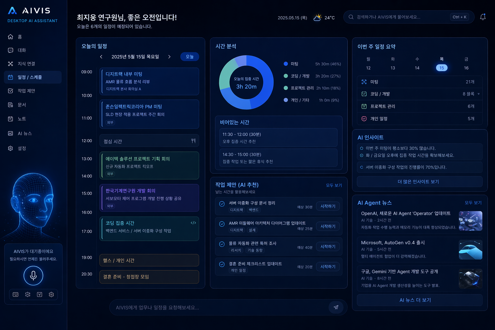
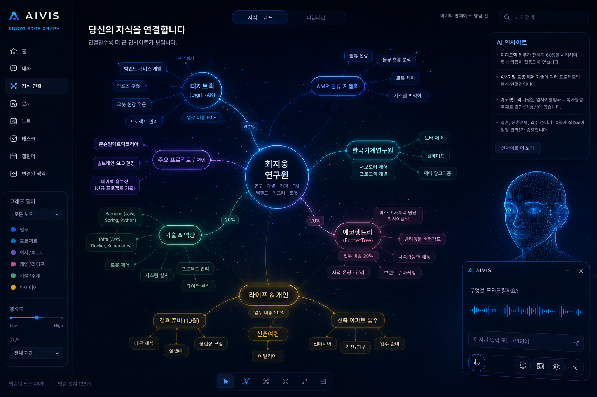
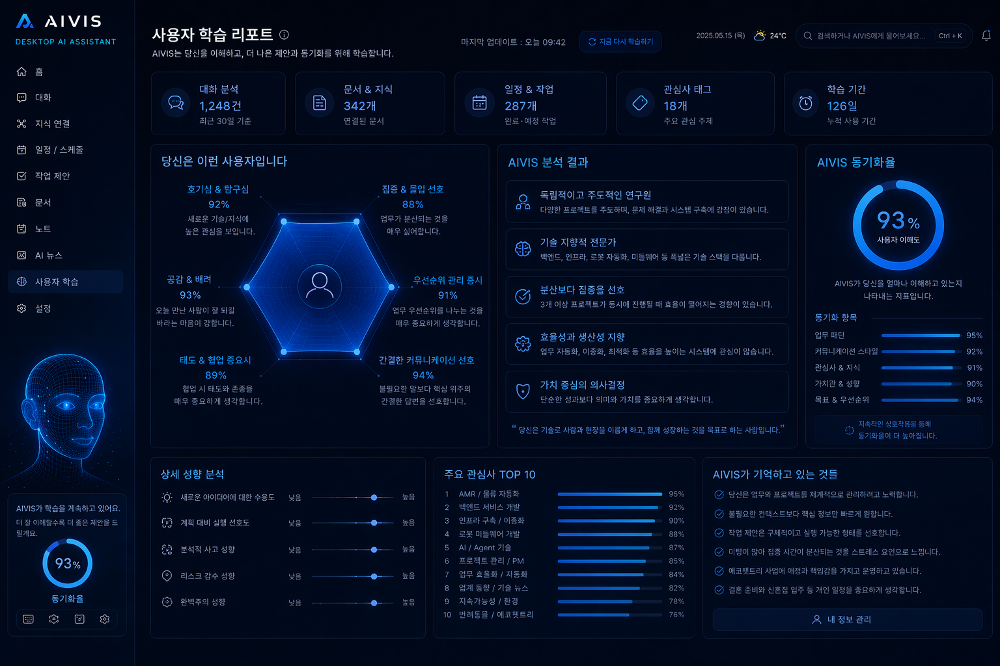

# AIVIS UI 화면 정의

## 화면 목록

### 1. 메인 랜딩 / 홈

**구성 요소:**
- AIVIS 로고 + 브랜드 슬로건
- 핵심 기능 3가지 소개 (지식 연결 / 사용자 학습 / 보안)
- 사용 시작 CTA 버튼
- 하단: push-to-talk 인터페이스 미리보기

**핵심 메시지:** "당신의 데스크탑, 초지능 비서 AIVIS"

---

### 2. 대시보드 (메인 화면)

**좌측 사이드바:**
- 홈 / Second Brain / 일정 / 메모 / 설정 네비게이션
- 사용자 프로필 + 현재 상태

**중앙:**
- 오늘의 일정 타임라인
- 시간 분석 도넛 차트 (집중/회의/이동 등)

**우측:**
- 다가오는 일정 목록
- AI 추천 정보
- AI Agent 목록 (활성 중인 에이전트)

**하단 고정:**
- push-to-talk 버튼
- 텍스트 입력창

---

### 3. Second Brain

**구성:**
- 중앙: 사용자 이름을 루트로 하는 Mind Map / Knowledge Graph
- 노드: 프로젝트, 관심사, 인물, 개념 등
- 클릭 시 해당 노트/연결 노트 표시
- 우측: 빠른 노트 추가 패널

**Obsidian Graph와 유사하나 AI가 자동으로 연결 생성**

---

### 4. 사용자 학습 리포트

**상단 지표:**
- 이번 주 대화 수 / 저장된 노트 수 / 주간 활성일 / 학습 항목 수

**중앙:**
- AIVIS가 학습한 나의 특성 (Hexagon 차트)
- AIVIS 학습 현황 점수 (0~100)
- AIVIS 진화도 (단계별)

**우측:**
- AIVIS 기억 목록 (최근 학습 항목)

**하단:**
- 자주 쓰는 기능 Top 10
- 관심사 키워드
- 개선 가능 영역 제안

---

## UX 원칙 (Ms. Kang 기준)

1. **Zero-prompt UX** — 프롬프트 작성법 몰라도 쓸 수 있어야 함
2. **투명한 AI** — AI가 무엇을 저장했는지 사용자가 항상 볼 수 있음
3. **Voice-first** — 키보드 없이 음성만으로 핵심 기능 모두 접근 가능
4. **로컬 우선** — 데이터가 어디 있는지 명확히 보여줌
5. **점진적 복잡성** — 처음엔 단순하게, 필요하면 깊이 들어갈 수 있게
